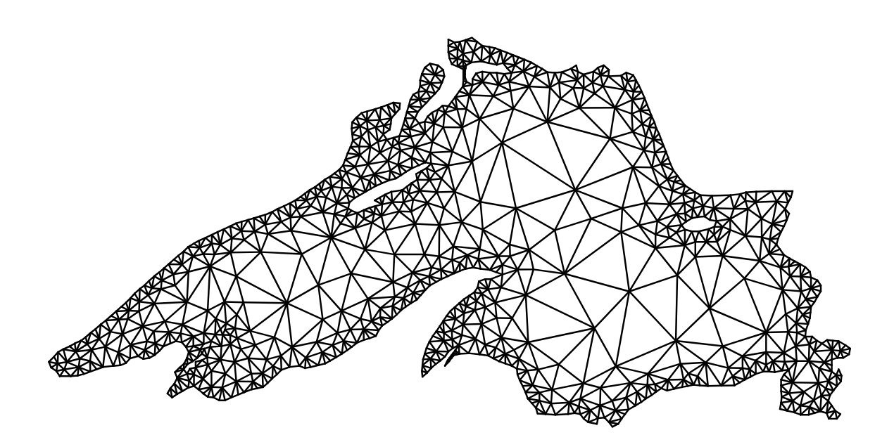

# 2D Mesh Generation with C++
Marcel Angenvoort
2025-04-02



## Abstract

In this repo Im developing a simple Delaunay mesh generator in C++. Such meshes are used in computational physics for solving differential equations; however, for simplicity, I will only focus on 2D triangulations here. I want to build a user interface using Qt6, where the user can add points and lines to define a geometry, and then click a button to generate the mesh, similar to the one above. The algorithms for generating such triangulations are relatively straightforward in theory, but actually implementing them can be tricky. Ideally, the UI and the backend will be separated so that the mesh generation algorithm can be used as a library, independent of the frontend. If there is enough time, I might also add the option to generate quadrilateral meshes later, but thats not a must. The purpose of this hobby project is to get a deeper understanding of computational geometry and to gain experience in building a complete software project.

## Project Idea

MVP:

- [ ] Graphical User Interface with Qt6
- [ ] [Delaunay triangulation](https://en.wikipedia.org/wiki/Delaunay_triangulation)
- [ ] Delaunay Refinement using [Rupperts algorithm](https://en.wikipedia.org/wiki/Delaunay_refinement#Ruppert%27s_algorithm)

Optional Features:

- [ ] Quadrilateral mesh generation
- [ ] Curved boundaries using B-splines
- [ ] Mesh of a [NACA airfoil](https://en.wikipedia.org/wiki/NACA_airfoil)
- [ ] Bindings for Python and ECMAScript

Goals:

- Build a simple clone of [Triangle](https://www.cs.cmu.edu/afs/cs/project/quake/public/www/tripaper/triangle3.html)
- Demonstrate my programming skills
- Get a deeper understanding of mesh generation

Non-Goals:

- 3D mesh generation
- Development of a competing software to [gmsh](https://gmsh.info)

> [!NOTE]
>
> The name of the application, SpiderMesh2D, may change in the future, once I’ve got a better idea of how to name it.

## Why C++?

C++ and Python are the two programming languages I am most familiar with.
While it would be possible to implement the application using NumPy and PySide6, it makes more sense to do the numerical computations in a more efficient language.

Furthermore, game engines are usually written in C++, and I hope that the experience I gain from developing this project will be useful in creating a 3D raytracer later on.

## Build Instructions

This projects uses [cmake presets](https://cmake.org/cmake/help/latest/manual/cmake-presets.7.html) to handle build configurations, [Ninja](https://ninja-build.org/) as a build generator, and [vcpkg](https://vcpkg.io/en/) for installing dependencies.
To build the program from source, first install Qt6 using the [Qt Online Installer](https://doc.qt.io/qt-6/qt-online-installation.html) or [aqtinstall](https://github.com/miurahr/aqtinstall):

``` bash
python -m pip install aqtinstall
aqt install-qt -O /opt/Qt linux desktop 6.4.0 linux_gcc_64 -m all
```

Then create a file called `CMakeUserPresets.json` containing the location of your Qt installation;
For example, if you had Qt 6.4.0 installed in the “/opt” directory, it would look something like this:

``` json
{
    "version": 2,
    "configurePresets": [
        {
            "name": "custom",
            "inherits": "ninja-multi",
            "cacheVariables": {
                "CMAKE_PREFIX_PATH": "/opt/Qt/6.4.0/gcc_64"
            }
        }
    ]
}
```

> [!WARNING]
>
> This project has been built and tested on Ubuntu 24.04 LTS using Qt 6.4.
> I make no guarantees that it will work on other platforms or with other versions of Qt.

Once you have installed Qt and created the CMakeUserPresets file, you can build the project as follows:

``` bash
cmake --preset ninja-multi      # Configure cmake
cmake --build --preset release  # Build executable
ctest --preset test-all         # Run unit tests
cpack --preset packages         # Build deb and rpm packages
doxygen                         # Generate documenation
```

## Usage

TODO

## License

SpiderMesh2D is licensed under the **European Union Public Licence (EUPL) version 1.2** or any later version.
The EUPL is a permissive open source licence written by the European Union and is compatible with other licences such as the MPL, LGPL or EPL.
See [eupl.eu](https://eupl.eu) for the full license text.

### LGPL Notice and User Rights Regarding Qt

> [!IMPORTANT]
>
> This application, SpiderMesh2D, utilizes the [Qt 6 framework](https://www.qt.io/product/qt6), which is licensed under the **GNU Lesser General Public License (LGPL) version 3**.

As a user, you have specific rights under the LGPL with respect to the Qt framework:

1.  **You have the right to use, modify, and distribute the Qt framework as licensed under the LGPL 3.**
    A copy of the LGPL license can be found at <https://www.gnu.org/licenses/lgpl-3.0.html>

2.  **You have the right to replace the Qt libraries used by this application with your own versions, as permitted by the LGPL.**
    This program is statically linked against the Qt libraries.
    You can recompile the application with a different version of Qt by following the [Build Instructions](#build-instructions) above.

## References

### Books

- **Grid Generation Methods** (Liseikin 2017)
- **Finite Element Mesh Generation** (S. H. Lo 2015)
- **Delaunay Mesh Generation** (Cheng, Dey, and Shewchuk 2013)
- **Mesh Generation: Application to Finite Elements** (Frey and George 2008)

### Paper

- **Guaranteed-quality mesh generation for curved surfaces** (Chew 1993)
- **A Delaunay Refinement Algorithm for Quality 2-Dimensional Mesh Generation** (Ruppert 1995)
- **Triangle: Engineering a 2D quality mesh generator and Delaunay triangulator** (Shewchuk 1996)
- **Delaunay refinement algorithms for triangular mesh generation** (Shewchuk 2002)

### Lecture Notes

- [An Introduction to Unstructured Mesh Generation Methods and Softwares for Scientific Computing](https://www.wias-berlin.de/people/si/course/), *WIAS Berlin* (Si 2019)
